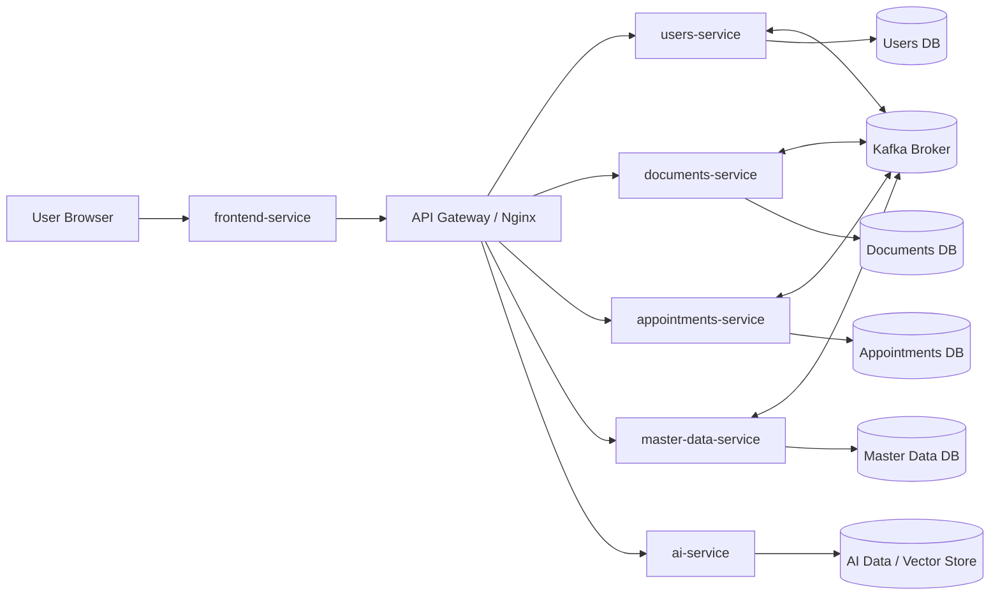

# Architecture Design

Once the bounded contexts were identified, we designed the Nucleo architecture around a microservices approach to keep components cohesive and independently evolvable.

The current architecture includes the following services:

- `frontend-service`: serves the web application.
- `users-service`: users, authentication, authorization, delegations, and notifications capability.
- `documents-service`: prescriptions, reports, uploads, and document metadata.
- `appointments-service`: availabilities and appointment lifecycle.
- `master-data-service`: facilities, medicines, and service types.
- `ai-service`: document analysis support and AI-assisted extraction.

In addition to business services, the platform relies on infrastructure components:

- API Gateway (Nginx) for north-south traffic routing.
- Kafka as event broker for asynchronous integration.
- Dedicated data stores owned by each service.

## Component & Connector View

This view describes the runtime components and their interaction styles.

### Interactions

Nucleo uses two main communication patterns:

- External communication: clients call the frontend, which reaches backend APIs through the gateway.
- Internal communication: services collaborate with synchronous HTTP calls when immediate consistency is required, and with Kafka events for process decoupling and eventual consistency.

### Proposed Architecture

## Architectural Rationale

- Bounded contexts map to service boundaries to preserve domain clarity.
- Database-per-service enforces ownership and reduces accidental coupling.
- Event-driven collaboration through Kafka improves autonomy and resilience.
- Gateway-based ingress keeps external APIs controlled and evolvable.
