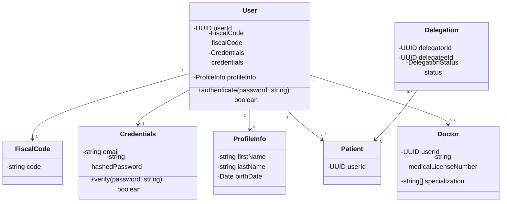
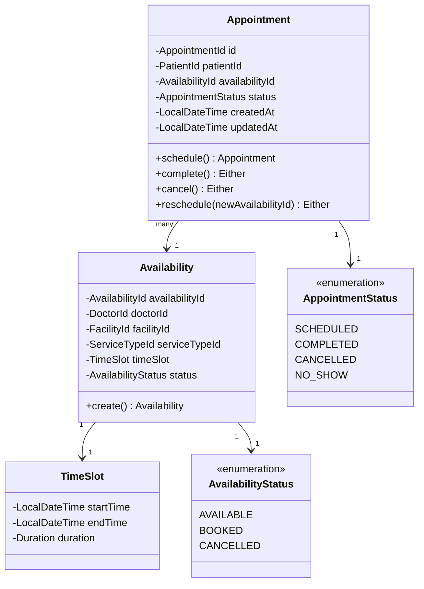
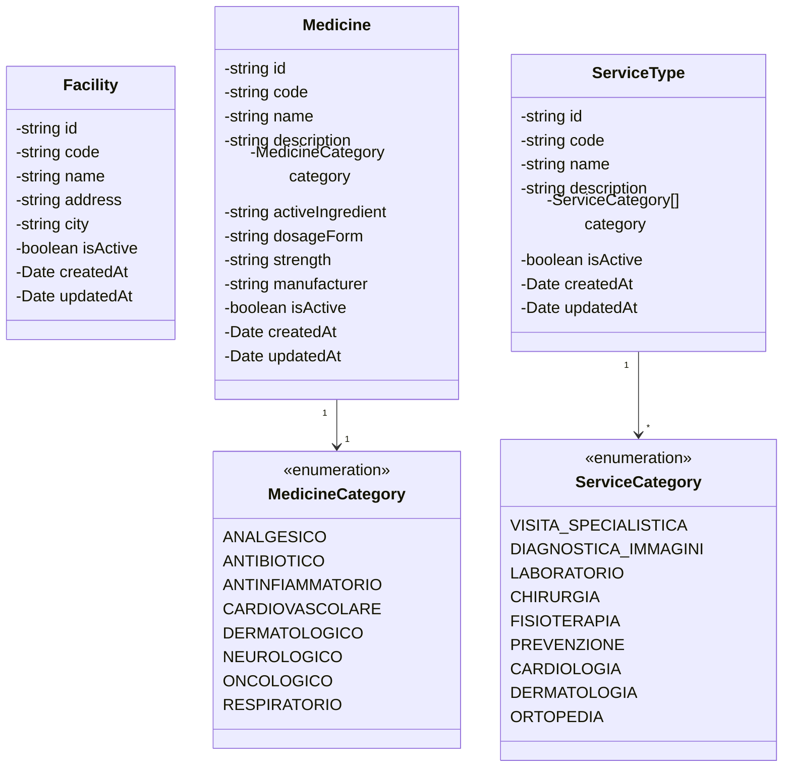
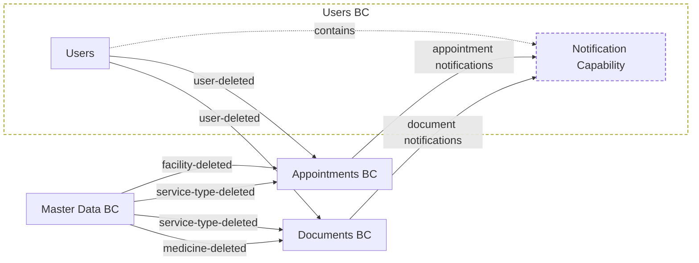

```mermaid
%%{init: {'themeVariables': {'fontSize': '20px'}}}%%
classDiagram
    class Document {
        <<interface>>
        -DocumentId id
        -DoctorId doctorId
        -PatientId patientId
        -IssueDate issueDate
        -Title title
        -FileMetadata metadata
        +withMetadata(metadata) Document
    }
    
    class Prescription {
        -Validity validity
        +isExpired() boolean
    }
    
    class Report {
        -ServicePrescription servicePrescription
        -ExecutionDate executionDate
        -ClinicalQuestion clinicalQuestion
        -Findings findings
        -Conclusion conclusion
        -Recommendations recommendations
    }
    
    class UploadedDocument {
        -string fileName
        -string mimeType
        -long fileSize
        -string fileUrl
    }
    
    class FileMetadata {
        -Summary summary
        -Set~Tag~ tags
    }
    
    class Validity {
        <<interface>>
        +isExpired() boolean
    }
    
    class UntilDate {
        -LocalDate date
    }
    
    class UntilExecution
    
    Document <|-- Prescription
    Document <|-- Report
    Document <|-- UploadedDocument
    Prescription "1" --> "1" Validity
    Validity <|-- UntilDate
    Validity <|-- UntilExecution
    Document "1" --> "1" FileMetadata
```

# Bounded Contexts

The system is organized into four main bounded contexts discovered during event storming and reflected in the current service boundaries. Each context is isolated and communicates through events following the Published Language pattern.

## Users

The `Users` bounded context is responsible for managing user identities, authentication, patient and doctor profiles, and delegations between patients.

### Domain Model

### Outbound Events

- **`users.user-deleted`**: Emitted when a user is deleted from the system. Consumed by Appointments and Documents contexts to maintain referential integrity.

### Notifications

Notifications are implemented inside the `Users` service (not as a standalone microservice). This capability consumes notification events from Kafka, persists them, and exposes them to frontend clients.

#### Responsibilities

- Consume events from Kafka topic
- Persist notifications and track read/unread status
- Expose user notification APIs

##### Notification Event Flows

- Inbound (consumed by `Users` notification capability):
    - `Users` (delegation created)
    - `Appointments` (appointment created/rescheduled/deleted)
    - `Documents` (prescriptions created, uploaded document)
- Outbound (produced by `Users`):
    - notification event for delegation creation

#### Strategic Position

For the notification stream, this capability acts as a downstream consumer of a shared Published Language payload (`receiver`, `title`, `content`).

## Appointments

The `Appointments` bounded context is responsible for managing doctor availabilities and patient appointment bookings.

### Domain Model

### Inbound Events

- **`users.user-deleted`**: When a user is deleted, related appointments are archived or cancelled.
- **`master-data.facility-deleted`**: When a facility is deleted, associated availabilities are removed.
- **`master-data.service-type-deleted`**: When a service type is deleted, related availabilities are updated.

### Outbound Notification Events

Notification event emitted:
- When an appointment is scheduled.
- When an appointment is rescheduled (patient/doctor variants).
- When an appointment is deleted.

## Documents

The `Documents` bounded context is responsible for managing clinical documents, prescriptions, reports, and medical record file handling.

### Domain Model

### Inbound Events

- **`users.user-deleted`**: When a user is deleted, related documents are archived.
- **`master-data.medicine-deleted`**: When a medicine is deleted, prescriptions referencing it are updated.
- **`master-data.service-type-deleted`**: When a service type is deleted, related documents are updated.

### Outbound Notification Events

Notification event emitted:
- When a medicine prescription is created.
- When an exam prescription is created.
- When a document is uploaded.

## Master Data

The `Master Data` bounded context is responsible for managing reference data consumed by other contexts: facilities, service types, and medicines catalog.

### Domain Model

### Outbound Events

- **`master-data.facility-deleted`**: Emitted when a facility is deleted. Consumed by Appointments.
- **`master-data.service-type-deleted`**: Emitted when a service type is deleted. Consumed by Appointments and Documents.
- **`master-data.medicine-deleted`**: Emitted when a medicine is deleted. Consumed by Documents.

## Context Map

The system uses asynchronous integration with Published Language event contracts. For deletion propagation, `Appointments` and `Documents` follow a **Conformist** relationship toward upstream `Users` and `Master Data` contracts.
For notification flows, `Users` acts as the downstream consumer of Notification Events produced by `Users`, `Appointments`, and `Documents`. This keeps notification persistence and delivery centralized in one place, while each upstream service remains responsible for emitting events tied to its own domain actions.

The currently implemented notification event types are:
- Delegation created (upstream producer: `Users` service)
- Medicine prescription created (upstream producer: `Documents` service)
- Exam prescription created (upstream producer: `Documents` service)
- Appointment scheduled (both from prescription and from scratch) (upstream producer: `Appointments` service)
- Appointment rescheduled by patient (upstream producer: `Appointments` service)
- Appointment rescheduled by doctor (upstream producer: `Appointments` service)
- Appointment deleted (upstream producer: `Appointments` service)
- Document uploaded (upstream producer: `Documents` service)

## Event Contracts

#### Users Context
- **Role in integration**:
    - *Inbound*: downstream consumer of Notification Events produced by `Users`, `Appointments`, and `Documents`.
    - *Outbound*: upstream publisher of domain events consumed by other contexts, such as:
        1. `users.user-deleted` → downstream `Appointments`, `Documents`
        2. notification event for delegation creation → downstream `Users` (notification capability)
- **Relationship**: Published Language as upstream publisher; Conformist as downstream consumer of notification contracts.
- **Purpose**: centralize user-related event handling, preserve referential integrity on user deletion, and deliver notifications.

#### Appointments Context
- **Role in integration**:
    - *Inbound*: downstream consumer of deletion events from `Users` and `Master Data`, such as:
        1. `users.user-deleted`
        2. `master-data.facility-deleted`
        3. `master-data.service-type-deleted`
    - *Outbound*: upstream producer of Notification Events consumed by `Users`, such as:
        1. appointment scheduled
        2. appointment rescheduled (patient/doctor variants)
        3. appointment deleted
- **Relationship**: Conformist toward upstream Published Language contracts.
- **Purpose**: keep appointment and availability data consistent with upstream deletions and publish appointment lifecycle notifications.

#### Documents Context
- **Role in integration**:
    - *Inbound*: downstream consumer of deletion events from `Users` and `Master Data`, such as:
        1. `users.user-deleted`
        2. `master-data.medicine-deleted`
        3. `master-data.service-type-deleted`
    - *Outbound*: upstream producer of Notification Events consumed by `Users`, such as:
        1. medicine prescription created
        2. exam prescription created
        3. document uploaded
- **Relationship**: Conformist toward upstream Published Language contracts.
- **Purpose**: keep document and prescription data aligned with upstream deletions and publish document-related notifications.

#### Master Data Context
- **Role in integration**:
    - *Inbound*: none for cross-context contracts in the current implementation.
    - *Outbound*: upstream publisher of reference-data deletion events, such as:
        1. `master-data.facility-deleted` → downstream `Appointments`
        2. `master-data.service-type-deleted` → downstream `Appointments`, `Documents`
        3. `master-data.medicine-deleted` → downstream `Documents`
- **Relationship**: Published Language as upstream publisher; downstream consumers apply a Conformist model.
- **Purpose**: synchronize reference-data deletions across dependent contexts.