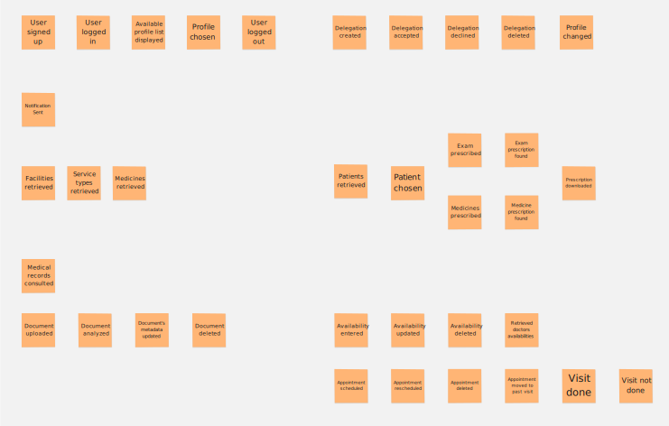
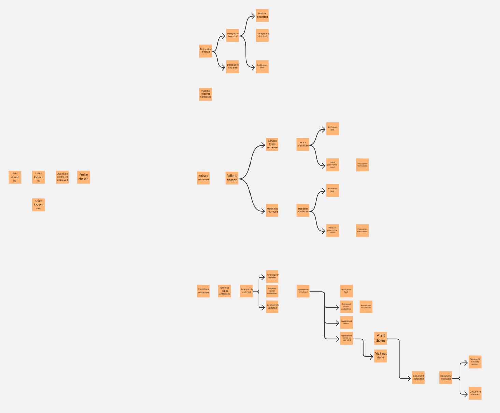
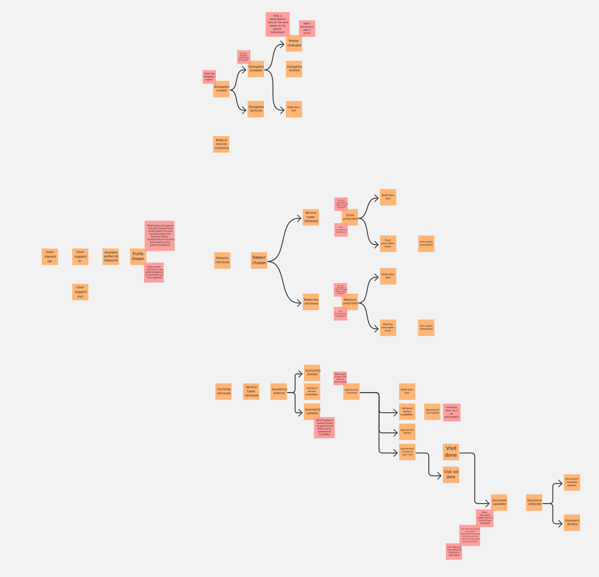
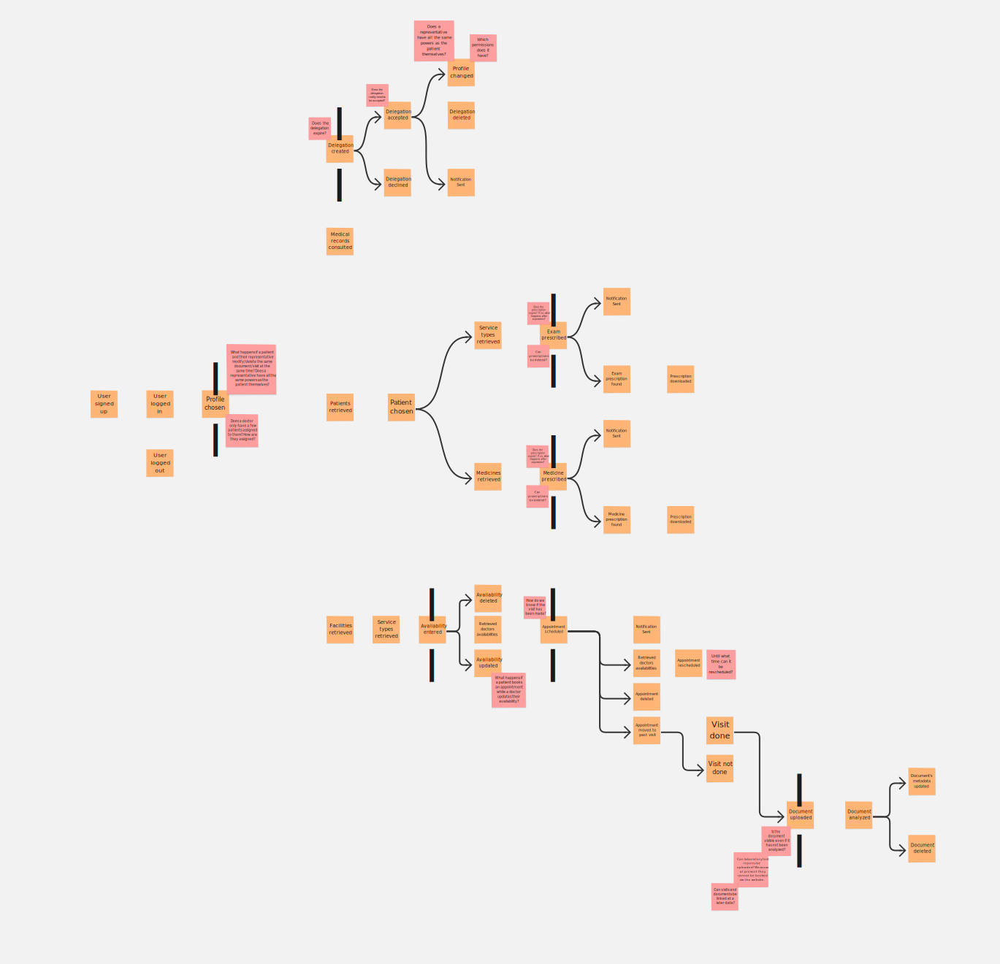
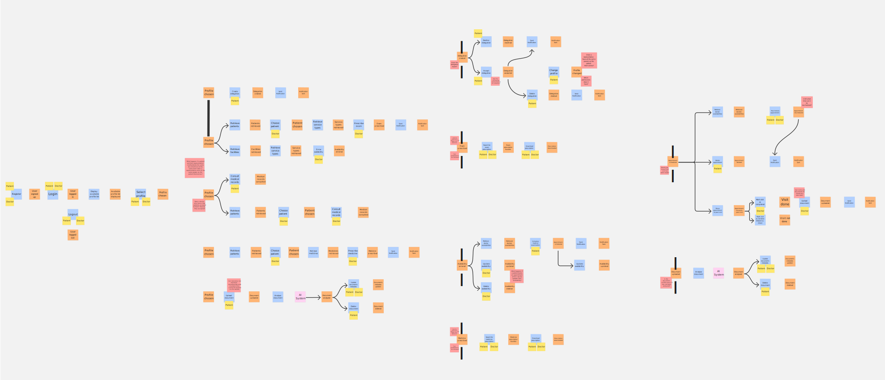
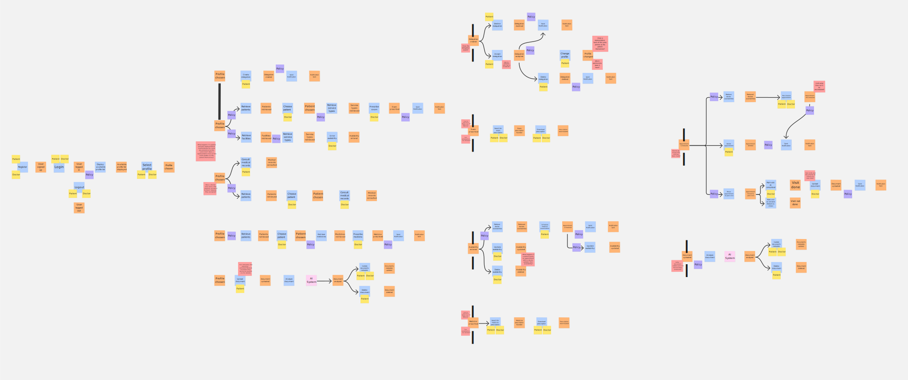
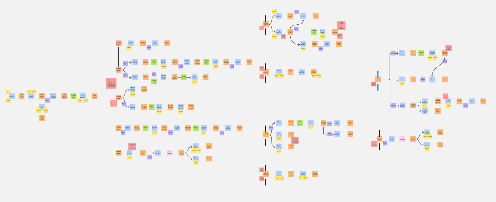
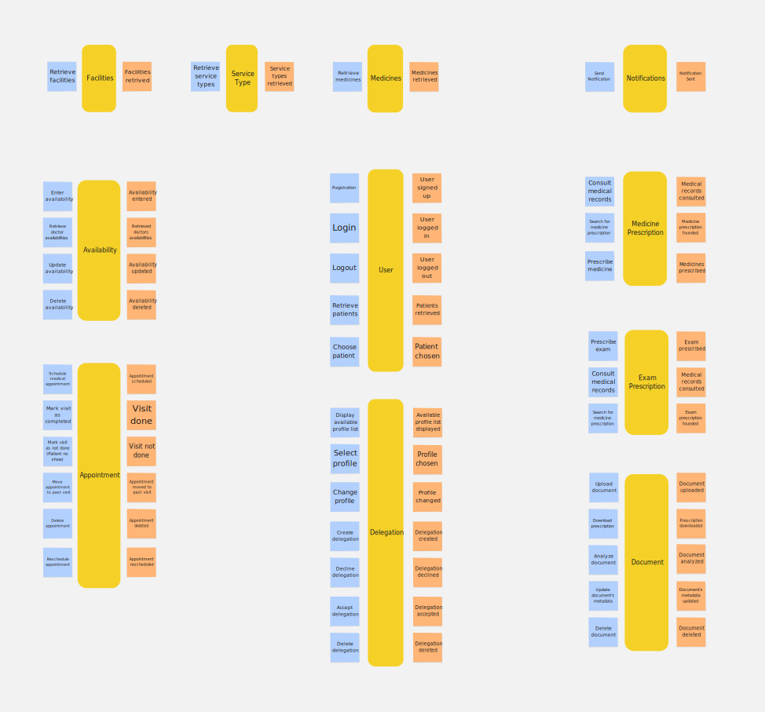
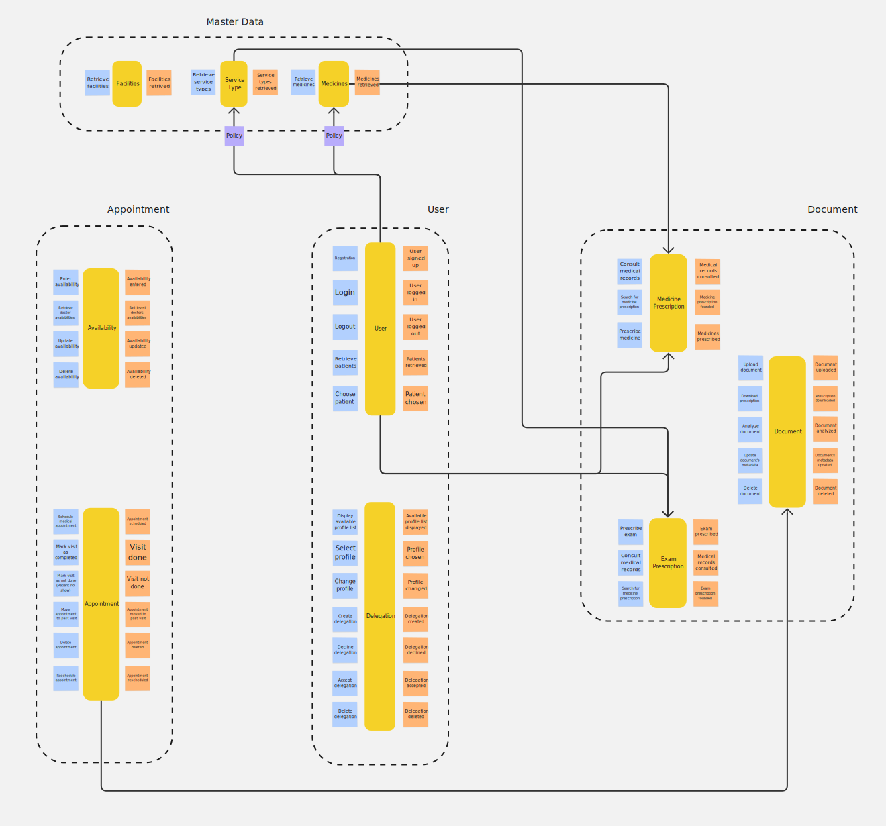

We conducted a virtual **Event Storming** session to explore the chosen domain and discover system boundaries. This section presents the outcomes of each phase of the iterative process.

The session was carried out using **Miro** as our collaborative workspace.

You can access the board here: Nucleo’s Event Storming

## Chaotic Exploration

In this phase, we brainstormed all possible **Domain Events** (represented by orange post its) that could occur within the system.

## Enforce the timeline

We organized the scattered events into a chronological flow from left to right.

## Pain Points

Using red stickers, we identified **Hotspots** or "Pain Points", i.e. processes that require further consideration and thoughtful analysis.

## Pivotal Points

We identified **Pivotal Points**, which are significant events marking a transition from one phase of the business process to another.

## Commands (+ People & Systems)

For every event, we identified the **Command** that triggered it. We specified the *actors* (Patient or Doctor) initiating the action and noted whenever an *external system* was required to complete the operation.

## Policies

We mapped out the **Policies**, which represent the "reactive" logic of the system. These are the "whenever" rules that automate workflows without direct human intervention once a specific event occurs.

## Read Models

We defined the **Read Models**, which are the specific views of data required by actors to make informed decisions.

## Aggregates

In this step, we grouped related commands and events into **Aggregates**. These represent the internal consistency boundaries of the domain, ensuring that all business rules and invariants are strictly enforced within a specific cluster of domain objects.

## Bounded Contexts

Finally, we established the **Bounded Contexts** by grouping aggregates that share a common model and language.

The identified bounded contexts are:

- `Users`
- `Appointment`
- `Document`
- `Notification`
- `Master Data`