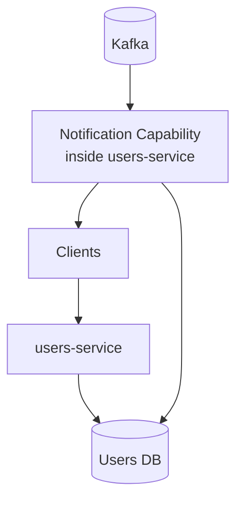
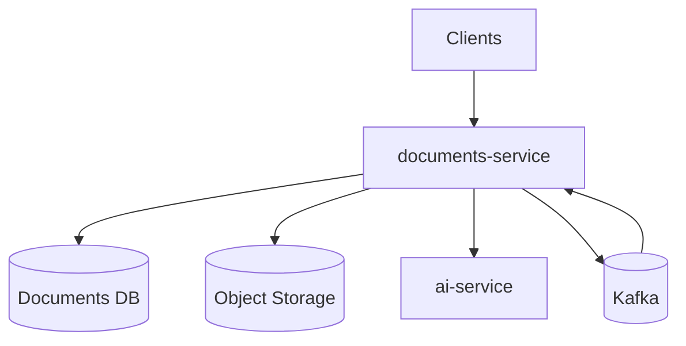
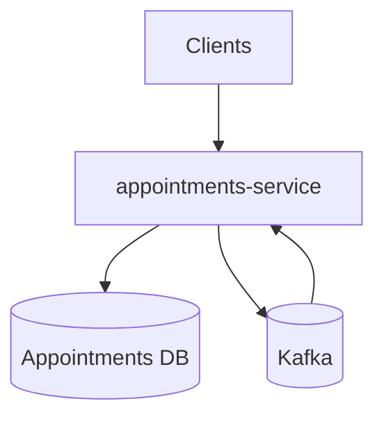
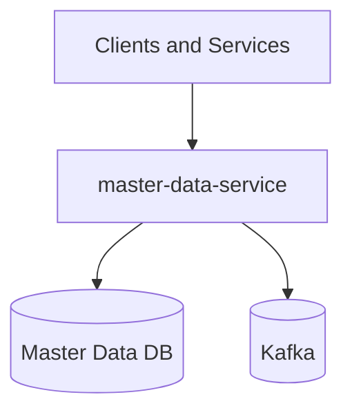
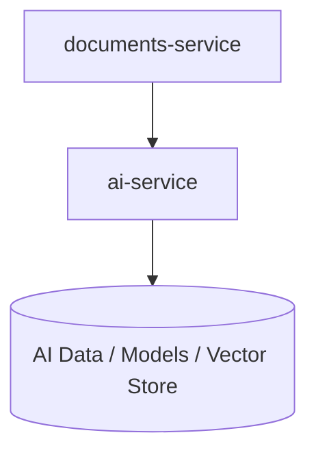
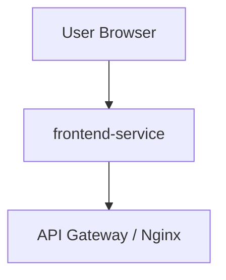

# Microservices Design

Once requirements, bounded contexts, and system-level architecture are defined, the next step is to describe each microservice as an autonomous unit with clear responsibilities, data ownership, and collaboration contracts.

In Nucleo, each service is designed around a domain boundary and owns both its API and persistence model.

## Users Microservice

### Behavior

Microservice responsible for identity and access related operations, including:

- User registration and authentication.
- Profile management for patient and doctor personas.
- Delegation workflows between patients.
- Notification ingestion and delivery capability (implemented inside this service, not as a standalone microservice).

### Main Collaborations

- Produces user lifecycle events such as user deletion.
- Consumes notification-related events produced by other services.

## Documents Microservice

### Behavior

Microservice responsible for clinical document lifecycle, including:

- Prescriptions and reports management.
- Uploaded medical document storage and metadata handling.
- Integration with AI analysis support.
- Emission of notification events for user-facing updates.

### Main Collaborations

- Consumes deletion/update events from Users and Master Data.
- Publishes notification events consumed by the notification capability in Users.

## Appointments Microservice

### Behavior

Microservice responsible for appointment scheduling and availability management, including:

- Doctor availability definition and publication.
- Appointment booking, rescheduling, and cancellation.
- Lifecycle transitions for appointments and slot consistency.
- Notification event publication for relevant actors.

### Main Collaborations

- Consumes user and master data deletion events to preserve data consistency.
- Publishes appointment notification events consumed by Users notification capability.

## Master Data Microservice

### Behavior

Microservice responsible for reference catalogs shared by other domains, including:

- Facilities catalog.
- Medicines catalog.
- Service types catalog.

### Main Collaborations

- Publishes deletion events consumed by Appointments and Documents.
- Acts as source of truth for cross-domain reference data.

## AI Microservice

### Behavior

Microservice responsible for AI-assisted processing, including:

- Extraction and enrichment of medical document information.
- Support to document workflows with analysis outcomes.

### Main Collaborations

- Primarily collaborates with Documents as an internal platform capability.

## Frontend Service

### Behavior

Service responsible for delivering the web client and orchestrating user interactions with backend APIs through the gateway.

## Related Design Views

For system-wide concerns that are intentionally not repeated in this page, refer to:

- Architecture-level views (component, module, deployment): [Architecture Design](architecture.md).
- Domain boundaries, context map, and event contracts: [Bounded Contexts](bounded-context.md).
