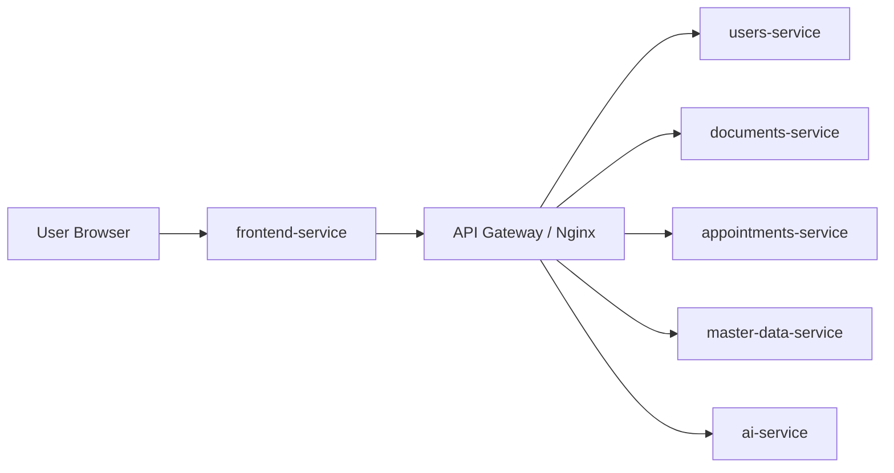
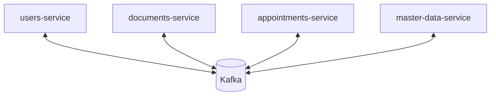
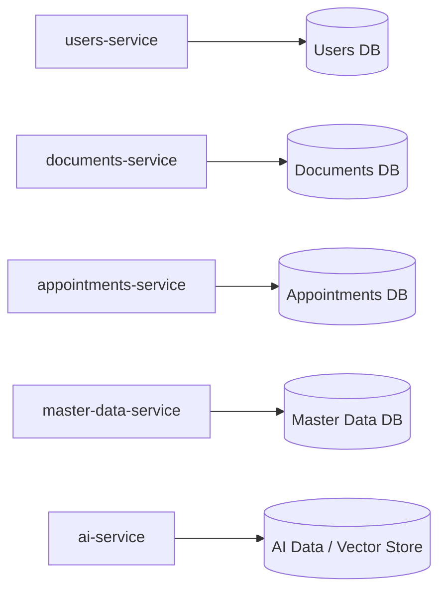
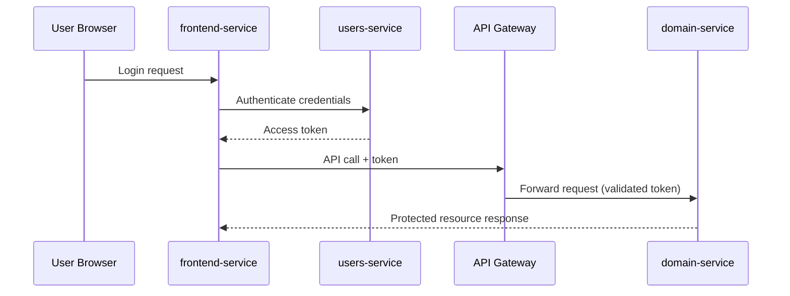

# Microservices Patterns

This page describes the key architectural patterns adopted in Nucleo and why they were selected.

The structure follows four viewpoints:

- Communication patterns.
- Deployment and observability patterns.
- Security patterns.

## Communication Patterns

### API Gateway

Nucleo uses an API Gateway (Nginx) as the single entry point for frontend and client traffic.

Main benefits in this project:

- Centralized routing to backend services.
- External API surface controlled in one place.
- Better evolvability because internal service changes remain hidden from clients.

### Event Publish/Subscribe

Nucleo uses asynchronous events over Kafka to decouple services and support eventual consistency.

Main benefits in this project:

- Producer and consumer autonomy.
- Reduced temporal coupling between services.
- Better resilience during temporary service unavailability.
- Easier addition of new subscribers without changing existing producers.

## Deployment and Observability Patterns

### Service as Containers

All services are containerized and can run consistently across local and cluster environments.

Main benefits in this project:

- Reproducible runtime behavior.
- Isolated service dependencies.
- Better portability and independent scaling.

### Database per Service

Each microservice owns its persistence boundary and does not allow direct data access from other services.

Main benefits in this project:

- Strong ownership of data and schema evolution.
- Reduced accidental cross-service coupling.
- Independent optimization of storage per domain.

### Externalized Configuration

Services use environment-based and deployment-time configuration (for example with Docker, Compose, and Helm values) rather than hardcoded environment data.

Main benefits in this project:

- Clear separation between code and runtime configuration.
- Easier promotion across environments.
- More secure handling of operational parameters.

### Health-check API

Nucleo services expose health endpoints (for example `/health`) to support runtime checks in local and deployment environments.

Main benefits in this project:

- Faster detection of unhealthy instances.
- Better operational reliability during deployments and service startup.

## Security Pattern

### Access Token

Nucleo secures API access using token-based authentication and authorization.

Main benefits in this project:

- Controlled access to protected resources.
- Stateless verification suitable for distributed services.
- Permission scoping and token lifecycle management.

