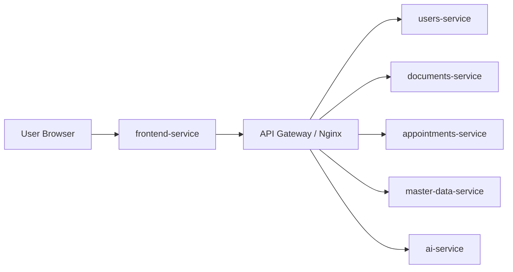
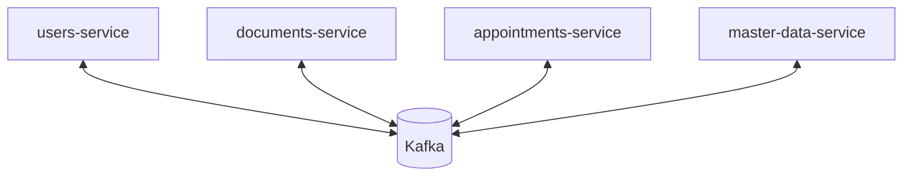
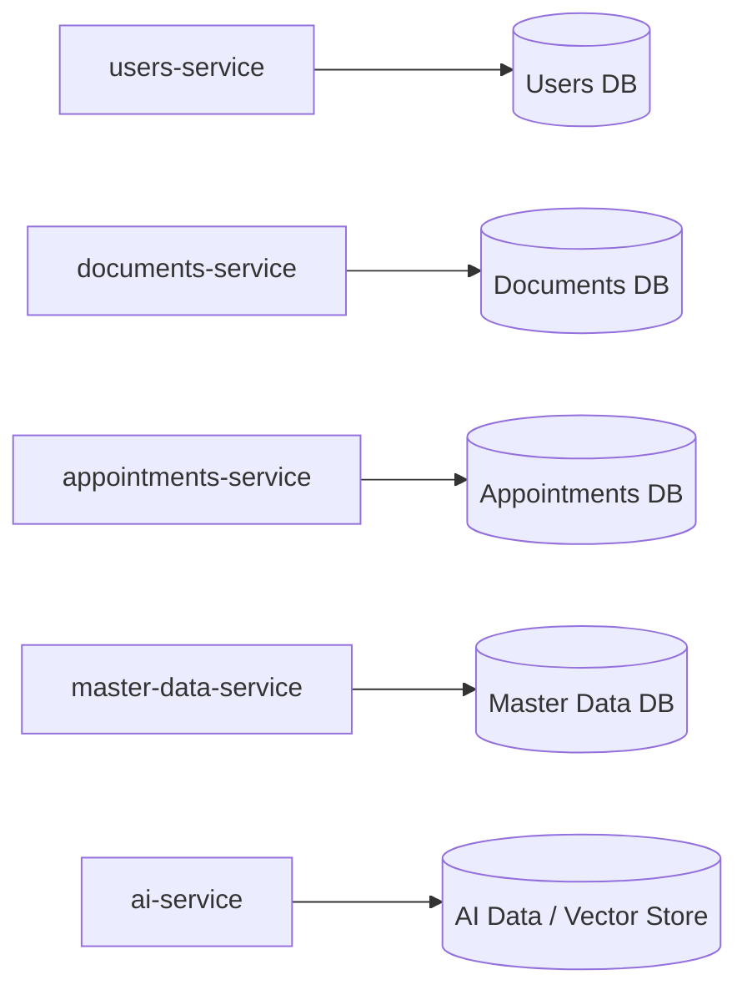
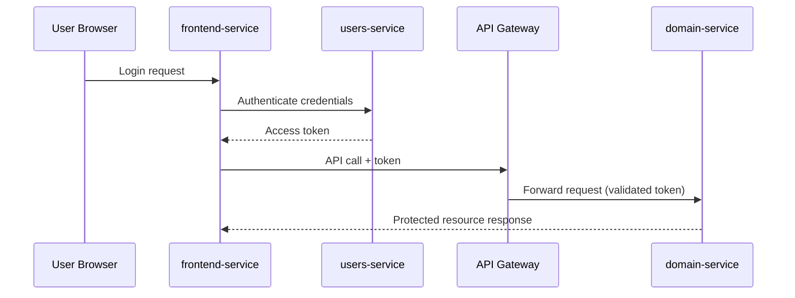

# Microservices Patterns

This page describes the key architectural patterns adopted in Nucleo and why they were selected.

## Communication Patterns

### API Gateway

Nucleo uses an API Gateway (Nginx) as the single entry point for frontend and client traffic.

Main benefits in this project:

- Centralized routing to backend services.
- External API surface controlled in one place.
- Better evolvability because internal service changes remain hidden from clients.

### Event Publish/Subscribe

Nucleo uses asynchronous events over Kafka to decouple services and support eventual consistency.

Main benefits in this project:

- Producer and consumer autonomy.
- Reduced temporal coupling between services.
- Better resilience during temporary service unavailability.
- Easier addition of new subscribers without changing existing producers.

## Deployment and Observability Patterns

### Service as Containers

All services are containerized and can run consistently across local and cluster environments.

### Database per Service

Each microservice owns its persistence boundary and does not allow direct data access from other services.

## Security Pattern

Nucleo secures API access using token-based authentication and authorization.

