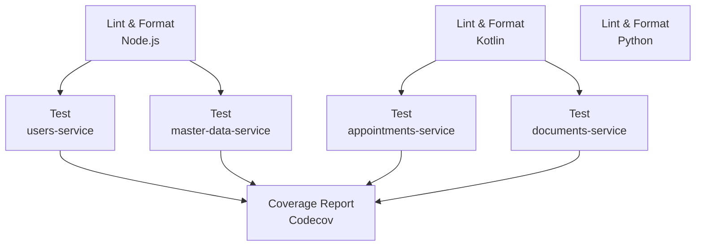
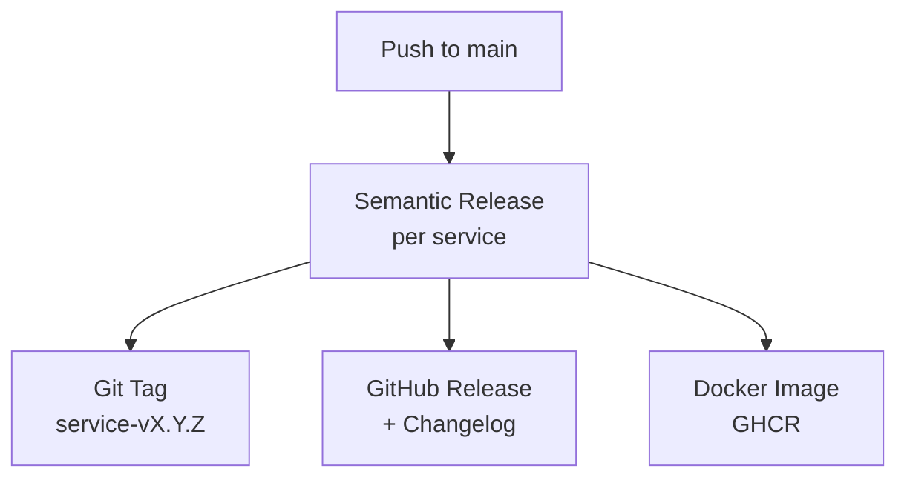
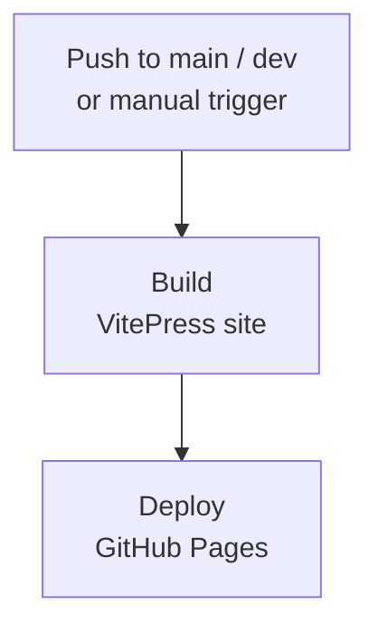

# Continuous Integration and Delivery

The project uses **GitHub Actions** to automate the CI/CD pipeline. Three workflows are defined, each with a distinct responsibility.

### Test Workflow

The test workflow runs on every push or pull request targeting the `main` and `dev` branches, and is skipped for documentation-only changes (commits affecting only `docs/` or Markdown files).

It is structured in three phases:

**Lint & Format** — three parallel jobs validate code style and static analysis across all runtimes:
- Node.js services are checked with [Prettier](https://prettier.io/) (formatting) and [ESLint](https://eslint.org/) (linting).
- Kotlin services are checked with [ktfmt](https://github.com/facebook/ktfmt) (formatting) and [Detekt](https://detekt.dev/) (static analysis).
- The Python service is checked with [Ruff](https://docs.astral.sh/ruff/) for both formatting and linting.

**Test** — each service has a dedicated test job that runs after its respective lint job passes. Unit tests and integration tests are executed separately; integration tests rely on [Testcontainers](https://testcontainers.com/) to spin up real infrastructure dependencies.

**Coverage Report** — once all test jobs complete successfully, a final job collects coverage data from all services and uploads it to [Codecov](https://codecov.io/).

### Release Workflow

The release workflow runs on every push to `main` and is responsible for versioning and publishing. It invokes Semantic Release across all services, which analyzes new commits, determines which services have unreleased changes, bumps their versions, and publishes the corresponding GitHub Releases and Docker images to GHCR.

### Docs Deployment Workflow

The documentation is built with [VitePress](https://vitepress.dev/) and deployed to GitHub Pages on every push to `main` or `dev`, as well as on manual trigger. The workflow builds the static site from the `docs/` directory and deploys it using the standard GitHub Pages Actions, making the latest documentation always available online.

### Dependency Updates

The project uses [Renovate](https://docs.renovatebot.com/) to keep dependencies up to date. Renovate periodically scans the repository and automatically opens pull requests whenever a newer version of a dependency is available, across all package ecosystems in the monorepo. The default configuration is used, with no custom rules.