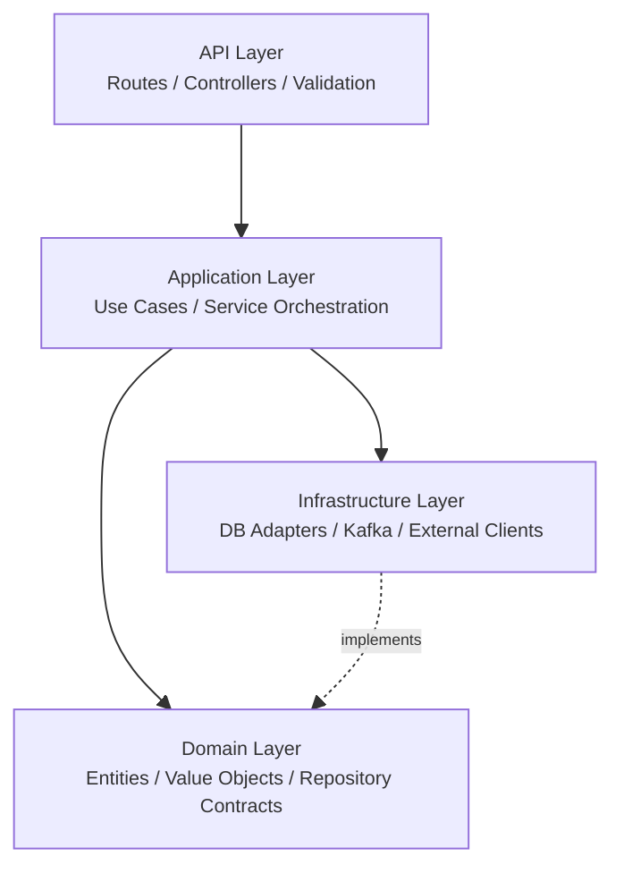

# Microservices Implementation

## Clean Architecture Perspective

Implementation choices are driven by a Clean Architecture objective: keep business decisions stable while allowing infrastructure and framework details to evolve. In practical terms, this means protecting domain and application logic from direct coupling to HTTP frameworks, database drivers, and broker clients.

The working rule across services is the dependency rule: dependencies point inward, while implementations of technical concerns stay outward. Repositories, event publishers, and external clients are modeled as ports in the inner layers and implemented as adapters in infrastructure.

## Layering Strategy

The implementation follows a practical layering model across runtimes:

- API layer (interface adapters): HTTP routes/controllers and request validation.
- Application layer (use cases): orchestration of workflows and domain rules.
- Domain layer (enterprise rules): entities/value objects and repository contracts.
- Infrastructure layer (frameworks and drivers): DB adapters, Kafka adapters, external service clients.

The diagram below summarizes dependency direction and the role of each layer.



The same shape is applied in Kotlin and Node.js services, with language-specific tooling.

From a Clean Architecture angle, this layering keeps controllers thin, use cases explicit, and infrastructure replaceable.

## Runtime Composition and Bootstrap

### Kotlin services (Ktor)

In `appointments-service`, the application is composed in one place, wiring middleware, DB, Kafka, and routes.

Source: `appointments-service/src/main/kotlin/it/nucleo/Application.kt` (`Application.module`).

```kotlin
fun Application.module() {
		configureSerialization()
		configureStatusPages()
		configureCors()
		configureCallLogging()
		installJwtAuthGuard()
		initializeDatabase()
		configureKafkaConsumers()
		configureRouting()
		logger.info("Application initialized successfully")
}
```

The same explicit module wiring approach is also used in `documents-service`, where bootstrap assembles MongoDB, MinIO, AI client, Kafka consumers, and HTTP routes in a single startup flow.

### Node.js services (Express)

In `users-service`, app creation is separated from DB connection and process startup.

Source: `users-service/src/app.ts` (`createApp`).

```ts
export function createApp(): Express {
	const app = express();

	app.use(cors());
	app.use(express.json());

	app.get('/health', function (_req, res) {
		res.json({ status: 'ok', timestamp: new Date().toISOString(), service: 'users-service' });
	});

	app.use('/api/auth', authRoutes);
	app.use('/api/users', requireAuth, userNotificationRoutes);
	app.use('/api/users', requireAuth, userRoutes);
	app.use('/api/delegations', requireAuth, delegationRoutes);

	return app;
}
```

The same app-factory and startup orchestration pattern is reused in `master-data-service` for consistency.

## API, Application, Domain Flow

### Kotlin vertical slice

In `appointments-service`, the Kotlin flow starts at the routing layer, where handlers validate and decode input, then delegate the use case to application services.

Source: `appointments-service/src/main/kotlin/it/nucleo/appointments/api/routes/AppointmentRoutes.kt` (`appointmentRoutes`).

```kotlin
post {
		val request =
				try {
						call.receive<CreateAppointmentRequest>()
				} catch (_: Exception) {
						return@post call.respond(
								HttpStatusCode.BadRequest,
								ErrorResponse(error = "INVALID_BODY", message = "Invalid request body")
						)
				}

		val result =
				service.createAppointment(
						patientId = request.patientId,
						availabilityId = request.availabilityId,
				)
		call.respondEither(result, HttpStatusCode.Created) { it.toResponse() }
}
```

The same API -> application -> domain pattern is applied in `documents-service`: routes in `documents/api/routes` handle request parsing and validation, then delegate business actions to `DocumentService`, which depends on the `DocumentRepository` domain contract.

At the application layer, services coordinate domain operations, repository calls, and external integrations such as event publication.

Source: `appointments-service/src/main/kotlin/it/nucleo/appointments/application/AppointmentService.kt` (`AppointmentService.createAppointment`).

```kotlin
class AppointmentService(
		private val appointmentRepository: AppointmentRepository,
		private val availabilityRepository: AvailabilityRepository,
		private val notificationEventsPublisher: NotificationEventsPublisher? = null
) {
		suspend fun createAppointment(
				patientId: String,
				availabilityId: String,
		): Either<DomainError, Appointment> {
				val patientId = PatientId(patientId).getOrElse { return failure(it) }
				val availabilityId = AvailabilityId(availabilityId).getOrElse { return failure(it) }
				val availability = availabilityRepository.findById(availabilityId)
						?: return failure(AvailabilityError.NotFound(availabilityId.value))
				// ... domain checks, save, side effects
		}
}
```

To keep business rules independent from persistence details, repository contracts are defined in the domain layer and implemented separately in infrastructure.
In Clean Architecture terms, `AppointmentRepository` is a port exposed by the inner layers; concrete Exposed/Mongo adapters implement it without changing application logic.

Source: `appointments-service/src/main/kotlin/it/nucleo/appointments/domain/AppointmentRepository.kt` (`AppointmentRepository`).

```kotlin
interface AppointmentRepository {
		suspend fun save(appointment: Appointment): Appointment
		suspend fun findById(id: AppointmentId): Appointment?
		suspend fun findByFilters(
				patientId: PatientId? = null,
				doctorId: DoctorId? = null,
				status: AppointmentStatus? = null
		): List<Appointment>
		suspend fun update(appointment: Appointment): Appointment?
}
```

### Node.js vertical slice

In `users-service`, the Node.js flow follows the same layering principle: routes validate payloads with Zod and then delegate orchestration to the service layer.

Source: `users-service/src/api/user.routes.ts` (`router.post('/')`).

```ts
router.post('/', async (req: Request, res: Response) => {
	try {
		const { fiscalCode, password, name, lastName, dateOfBirth, doctor } = validateWithSchema(
			createUserBodySchema,
			req.body,
			'create user body'
		);

		const user = await userService.createUser({
			fiscalCode,
			password,
			name,
			lastName,
			dateOfBirth,
			doctor,
		});

		return success(res, user, 201);
	} catch (err) {
		return handleRouteError(res, err, 'Create user error', USER_ERROR_RULES);
	}
});
```

The same vertical slice is used in `master-data-service`: route handlers (for example `service-catalog.routes`) validate input, delegate to `ServiceCatalogService`, and rely on repository interfaces defined in the domain layer.

At service level, orchestration includes aggregate updates, consistency checks, and publication of cross-service events when required.

Source: `users-service/src/services/user.service.ts` (`UserService.deleteUser`).

```ts
export class UserService {
	constructor(
		private readonly userRepository: UserRepository,
		private readonly patientRepository: PatientRepository,
		private readonly doctorRepository: DoctorRepository,
		private readonly userEventsPublisher: UserEventsPublisher | null = null
	) {}

	async deleteUser(userId: string) {
		const existingUser = await this.userRepository.findUserById(userId);
		if (!existingUser) throw new Error('User not found');

		await this.patientRepository.delete(userId);
		await this.doctorRepository.delete(userId);
		await this.userRepository.delete(userId);

		await this.userEventsPublisher?.publishUserDeleted({
			userId,
			deletedAt: new Date().toISOString(),
		});
	}
}
```

## Event-Driven Integration (Kafka)

### Producers

In `appointments-service`, domain actions that require user-facing communication are translated into Kafka notification events.

Source: `appointments-service/src/main/kotlin/it/nucleo/appointments/infrastructure/kafka/NotificationEventsPublisher.kt` (`NotificationEventsPublisher.publish`).

```kotlin
fun publish(receiver: String, title: String, content: String? = null) {
		if (!isEnabled() || receiver.isBlank() || title.isBlank()) {
				return
		}

		val event =
				NotificationEvent(
						receiver = receiver,
						title = title,
						content = content,
						sourceService = clientId,
						occurredAt = Instant.now().toString()
				)

		getOrCreateProducer().send(ProducerRecord(notificationsTopic, receiver, json.encodeToString(event)))
}
```

In `master-data-service`, lifecycle changes on reference data are emitted as deletion events for downstream consumers.

Source: `master-data-service/src/infrastructure/kafka/master-data-events.publisher.ts` (`MasterDataEventsPublisher`).

```ts
async publishServiceTypeDeleted(event: EntityDeletedEvent): Promise<void> {
	await this.publish(this.serviceTypeDeletedTopic, event);
}

private async publish(topic: string, event: EntityDeletedEvent): Promise<void> {
	if (!this.isEnabled(topic)) return;
	await this.ensureConnected();

	await this.producer?.send({
		topic,
		messages: [{ key: event.id, value: JSON.stringify(event) }],
	});
}
```

Within Clean Architecture boundaries, event publishing is modeled as an infrastructure concern triggered by application workflows, not as a domain-side broker dependency.

### Consumers

In `documents-service`, delete events are consumed to trigger data cleanup and preserve cross-service consistency.

Source: `documents-service/src/main/kotlin/it/nucleo/documents/infrastructure/kafka/DeleteEventsConsumer.kt` (`DeleteEventsConsumer.handleRecord`).

```kotlin
private fun handleRecord(topic: String, payload: String) {
		when (topic) {
				userDeletedTopic -> handleUserDeleted(payload)
				medicineDeletedTopic -> handleMedicineDeleted(payload)
				serviceTypeDeletedTopic -> handleServiceTypeDeleted(payload)
				else -> logger.warn("Received message from unexpected topic: {}", topic)
		}
}
```

In `users-service`, notification events are consumed and persisted so they can be surfaced to end users.

Source: `users-service/src/infrastructure/kafka/notification-events.consumer.ts` (`NotificationEventsConsumer.start`).

```ts
this.consumer.run({
	eachMessage: async ({ message }) => {
		if (!message.value) return;

		const parsed = JSON.parse(message.value.toString()) as RawNotificationEvent;
		const payload = this.parseNotificationEvent(parsed);
		if (!payload) return;

		await this.notificationService.consumeNotificationEvent(payload);
	},
});
```

Consumers therefore act as inbound adapters: they translate transport-level messages into application actions.

## Persistence Implementations

### SQL persistence

For relational persistence, `appointments-service` uses PostgreSQL through Exposed repositories and coroutine-based transactions.

Source: `appointments-service/src/main/kotlin/it/nucleo/appointments/infrastructure/persistence/ExposedAppointmentRepository.kt` (`ExposedAppointmentRepository.save`).

```kotlin
override suspend fun save(appointment: Appointment): Appointment = dbQuery {
		AppointmentsTable.insert {
				it[appointmentId] = appointment.id.value
				it[patientId] = appointment.patientId.value
				it[availabilityId] = appointment.availabilityId.value
				it[status] = appointment.status.name
				it[createdAt] = appointment.createdAt.toJavaLocalDateTime()
				it[updatedAt] = appointment.updatedAt.toJavaLocalDateTime()
		}
		appointment
}
```

The repository implementation is an outbound adapter for a domain contract, so switching persistence strategy does not alter use-case orchestration.

### Mongo persistence

For document-oriented persistence, `documents-service` uses MongoDB and performs atomic updates on nested medical record arrays.

Source: `documents-service/src/main/kotlin/it/nucleo/documents/infrastructure/persistence/mongodb/MongoDocumentRepository.kt` (`MongoDocumentRepository.addDocument`).

```kotlin
collection.updateOne(
		Filters.eq(MedicalRecordDocument::patientId.name, patientId.id),
		Updates.push(MedicalRecordDocument::documents.name, bsonDoc),
		UpdateOptions().upsert(true)
)
```

In `users-service`, MongoDB repositories handle user authentication data, patient and doctor profiles, and delegation relationships. Repository implementations inherit the same contract from the domain layer and perform standard CRUD operations via Mongoose models.

Source: `users-service/src/infrastructure/repositories/implementations/user-repository.impl.ts` (`UserRepositoryImpl.findByFiscalCode`, `save`, `create`).

```ts
async findByFiscalCode(fiscalCode: string): Promise<UserData | null> {
	const user = await UserModel.findOne({ fiscalCode: fiscalCode.toUpperCase() });
	if (!user) return null;
	return this.toUserData(user);
}

async save(user: User): Promise<void> {
	const update = {
		fiscalCode: user.fiscalCode.value,
		passwordHash: user.credentials.passwordHash,
		name: user.profileInfo.name,
		lastName: user.profileInfo.lastName,
		dateOfBirth: user.profileInfo.dateOfBirth,
	};

	const result = await UserModel.findOneAndUpdate({ userId: user.userId }, update, { new: false });
	if (!result) throw new Error(`User with id ${user.userId} does not exist`);
}

async create(user: User): Promise<void> {
	await UserModel.create({
		userId: user.userId,
		fiscalCode: user.fiscalCode.value,
		passwordHash: user.credentials.passwordHash,
		name: user.profileInfo.name,
		lastName: user.profileInfo.lastName,
		dateOfBirth: user.profileInfo.dateOfBirth,
	});
}
```

In `master-data-service`, reference data repositories (service types, facilities, medicines) maintain catalog information across the platform. Each repository uses Mongoose to implement soft and permanent deletes, ensuring backward compatibility while supporting cascading cleanup from event consumers.

Source: `master-data-service/src/infrastructure/repositories/implementations/service-type-repository.impl.ts` (`ServiceTypeRepositoryImpl.findAll`, `create`, `softDelete`).

```ts
async findAll(query: RepositoryQuery): Promise<ServiceType[]> {
	const docs = await ServiceTypeModel.find(query).sort({ code: 1 });
	return docs.map(this.toServiceType);
}

async create(data: ServiceTypeCreateData): Promise<ServiceType> {
	const serviceType = new ServiceTypeModel({ _id: data.code, ...data });
	const doc = await serviceType.save();
	return this.toServiceType(doc);
}

async softDelete(id: string): Promise<ServiceType | null> {
	const doc = await ServiceTypeModel.findByIdAndUpdate(
		id,
		{ isActive: false },
		{ new: true }
	);
	return doc ? this.toServiceType(doc) : null;
}
```

## Documents and AI Service Integration

In `documents-service`, an infrastructure HTTP client invokes the Python AI service:

Source: `documents-service/src/main/kotlin/it/nucleo/documents/infrastructure/ai/AiServiceClient.kt` (`AiServiceClient.analyzeDocument`).

```kotlin
suspend fun analyzeDocument(patientId: String, documentId: String): AiAnalysisResult {
		val url = URI("$baseUrl/analyze").toURL()
		val connection = url.openConnection() as HttpURLConnection

		connection.requestMethod = "POST"
		connection.setRequestProperty("Content-Type", "application/json")
		connection.doOutput = true

		val requestBody = """{"document_id": "$documentId", "patient_id": "$patientId"}"""
		connection.outputStream.use { os ->
				os.write(requestBody.toByteArray(Charsets.UTF_8))
		}
		// ... map HTTP response to AiAnalysisResult
}
```

On the AI side, the FastAPI service exposes the analysis endpoint consumed by `documents-service`.

Source: `ai-service/src/main.py` (`analyze_document`).

```python
@app.post("/analyze", response_model=AnalyzeResponse)
async def analyze_document(request: AnalyzeRequest):
		pdf_content = minio_client.fetch_document(request.patient_id, request.document_id)
		document_text = pdf_extractor.extract_text(pdf_content)
		metadata = ai_analyzer.analyze(document_text)

		return AnalyzeResponse(
				success=True,
				summary=metadata.summary,
				tags=metadata.tags,
		)
```
